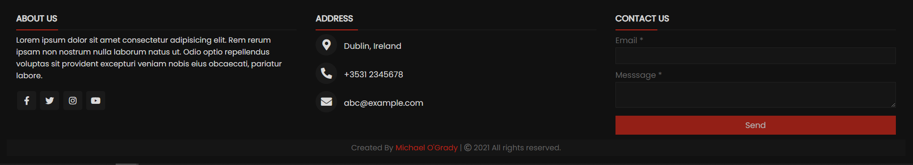

# Footer Collection

Collection of Footers in HTML CSS.

> Emphasis of this project is on building hand-coded Footer's avoiding the use of Bootstrap or JavaScript

- [x] sleek

### Task List

- [ ] Continue to Build on Existing Collection of Footer's

# Footers

## Sleek

<h1 align="center">
 
</h1>

